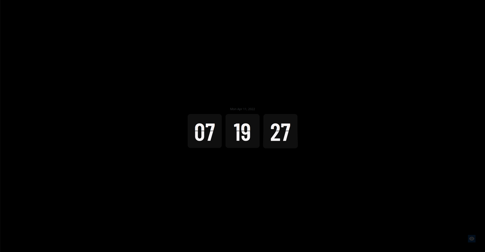

# React Flip Clock Time Tracker

Working in a company that needs you to track time while doing your work is by no means a hard task. But having a tool to make it easier definitely helps your work flow. This tool speeds up my time tracking process every week.

## Table of contents

- [Overview](#overview)
  - [Description](#description)
  - [Screenshot](#screenshot)
  - [Links](#links)
- [My process](#my-process)
  - [Built with](#built-with)
  - [What I learned](#what-i-learned)
  - [Useful resources](#useful-resources)
- [Author](#author)

## Overview

### Description

The company that I currently work for has us keep track of our time and submit it each week so that they know what to charge the clients we work with. I keep an Ipad as a display on my desk and created this site to show the current time in a visually appealing flip clock look. There is also functionality to start a work timer for each day. When you are dont working for the day you can submit the time and it saves to local storage to display all week. So at the end of the week I can go back through and see my times.

### Screenshot

### Links

- Live Site URL: [https://aaron-soto.github.io/react-clock/](https://aaron-soto.github.io/react-clock/)

## My process

### Built with

- [React](https://reactjs.org/) - JS library
- [MomentJs](https://momentjs.com/) - JS library
- SCSS with custom mixins and variables
- useState, useEffect hooks

### What I learned

This project helps with the understanding of date objects as well as localStorage usage. I also applied some new SCSS techniques that helped speed up my workflow.

### Useful resources

- [Moment Js Docs](https://momentjs.com/docs/) - formatting time so that it is user friendly is not always an easy task but good documentation really helps.

## Author

- Website - [Aaron Soto](https://aaronsoto.io)
- Github - [@aaron-soto](https://github.com/aaron-soto)
- Linkedin - [@aaron-soto1](https://www.linkedin.com/in/aaron-soto1/)
